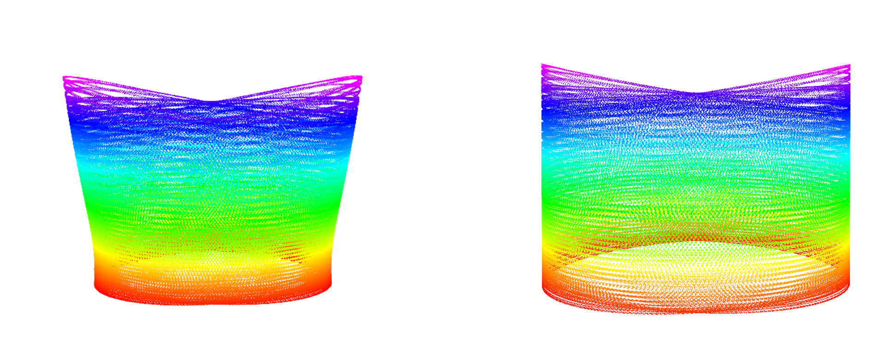

# Livox LiDAR Simulation

A ROS 2 system plugin that simulates non-repetitive Livox scan patterns in
Gazebo Sim. It is based on the original
[Livox Gazebo Classic plugin](https://github.com/Livox-SDK/livox_laser_simulation)
and retains per-point timing and Livox-compatible output formats without a
dependency on the Livox SDK or driver.

This branch targets ROS 2 Humble and Gazebo Harmonic (Gazebo Sim 8). Gazebo
Classic, Ignition Gazebo, and ROS 1 sources have been removed.

## KangjianPeng Fork Changes

This fork upgrades the package for Gazebo Sim (Ignition) and uses Ogre2
`GpuRays` to render regular distance images on the GPU before resampling them
with Livox scan patterns. It also adds a `fast_livo/msg/CustomMsg` output mode
for the FAST-LIVO2 simulation pipeline.

## Features

- Includes measured scan patterns for Avia, Horizon, Mid-40, Mid-70,
  Mid-360, and Tele-15.
- Publishes ROS 2 `sensor_msgs/msg/PointCloud2` directly from the simulator.
- Supports XYZ, Livox-style PointCloud2, and Livox custom message output.
- Uses simulation time for message headers and per-point timestamps.
- Supports GUI and server-only headless rendering.
- Uses Ogre2 `GpuRays` to render one regular distance image per scan and maps
  measured Livox directions to the nearest GPU pixel.
- Resolves scan patterns from the installed package, so SDF files are portable.



## Scan Patterns

| Model | Pattern file | `line_count` | `point_rate` |
| --- | --- | ---: | ---: |
| Livox Avia | `avia.csv` | 6 | 240000 |
| Livox Horizon | `horizon.csv` | 6 | 240000 |
| Livox Mid-40 | `mid40.csv` | 1 | 100000 |
| Livox Mid-70 | `mid70.csv` | 1 | 100000 |
| Livox Mid-360 | `mid360.csv` | 4 | 200000 |
| Livox Tele-15 | `tele.csv` | 6 | 240000 |

The packaged SDF model is a Mid-360 example. The plugin itself is model
independent: select another pattern file and its matching line count and point
rate when embedding it in a robot model.

The `gpu_lidar` angular grid must cover the selected scan pattern. The following
counts keep the angular spacing at or below approximately 0.1 degrees when the
grid limits are set to the measured pattern limits:

| Model | Horizontal range (deg) | Vertical range (deg) | Minimum grid |
| --- | ---: | ---: | ---: |
| Livox Avia | -35.310 to 35.309 | -38.591 to 38.591 | 708 x 773 |
| Livox Horizon | -40.957 to 40.959 | -14.092 to 14.092 | 821 x 283 |
| Livox Mid-40 | -19.173 to 19.173 | -19.173 to 19.173 | 385 x 385 |
| Livox Mid-70 | -35.215 to 35.216 | -35.216 to 35.215 | 706 x 706 |
| Livox Mid-360 | -180.000 to 180.000 | -7.212 to 52.164 | 3601 x 595 |
| Livox Tele-15 | -7.324 to 7.324 | -8.127 to 8.127 | 148 x 164 |

## Supported Environment

| Component | Tested version |
| --- | --- |
| Ubuntu | 22.04 |
| ROS 2 | Humble |
| Gazebo Sim | Harmonic / Gazebo Sim 8 |
| Compiler | GCC 11 |

## Dependencies

Install ROS 2 Humble, Gazebo Harmonic, and the ROS / Gazebo integration:

```bash
sudo apt update
sudo apt install \
  ros-humble-ros-gz \
  ros-humble-rviz2 \
  ros-humble-tf2-ros
```

## Build

Clone the repository into a ROS 2 workspace and build it with `colcon`:

```bash
mkdir -p ~/livox_ws/src
cd ~/livox_ws/src
git clone https://github.com/KangjianPeng/livox_laser_simulation.git
cd ..
source /opt/ros/humble/setup.bash
colcon build --symlink-install --cmake-args -DCMAKE_BUILD_TYPE=Release
source install/setup.bash
```

## Run The Example

Start Gazebo, spawn the Mid-360 model, bridge `/clock`, and open RViz:

```bash
ros2 launch livox_laser_simulation simulation.launch.py
```

The example keeps the lidar static at the center of a four-wall, open-top test
room. The walls are translucent in Gazebo, and the ground is collision-only, so
RViz shows wall returns without unrelated ground points while the sensor model
remains visible from above.

For SSH, CI, or machines without a display:

```bash
ros2 launch livox_laser_simulation simulation.launch.py \
  headless:=true rviz:=false
```

Verify the output:

```bash
ros2 topic info /livox/lidar
ros2 topic hz /livox/lidar
ros2 topic echo /livox/lidar --once --field fields
```

## Add The Plugin To A Model

The plugin must be attached to an SDF `gpu_lidar` sensor. Ogre2 renders the
configured regular distance image on the GPU, and the plugin samples that image
at the directions from the selected Livox pattern.

```xml
<sensor type="gpu_lidar" name="livox_mid360">
  <pose>0 0 0.05 0 0 0</pose>
  <always_on>true</always_on>
  <update_rate>10</update_rate>
  <visualize>false</visualize>
  <topic>/livox/lidar/scan</topic>
  <ray>
    <scan>
      <horizontal>
        <samples>3601</samples>
        <resolution>1</resolution>
        <min_angle>-3.141592653589793</min_angle>
        <max_angle>3.141592653589793</max_angle>
      </horizontal>
      <vertical>
        <samples>595</samples>
        <resolution>1</resolution>
        <min_angle>-0.125878381641587</min_angle>
        <max_angle>0.910433551010322</max_angle>
      </vertical>
    </scan>
    <range>
      <min>0.1</min>
      <max>40.0</max>
      <resolution>1</resolution>
    </range>
  </ray>
  <plugin filename="liblivox_laser_simulation.so"
          name="livox_laser_simulation::LivoxLidarSystem">
    <gpu_topic>/livox/lidar/scan</gpu_topic>
    <csv_file_name>mid360.csv</csv_file_name>
    <samples>20000</samples>
    <downsample>1</downsample>
    <line_count>4</line_count>
    <point_rate>200000</point_rate>
    <min_range>0.1</min_range>
    <max_range>40.0</max_range>
    <publish_pointcloud_type>2</publish_pointcloud_type>
    <ros_topic>/livox/lidar</ros_topic>
    <frame_name>livox_frame</frame_name>
    <use_inf>false</use_inf>
  </plugin>
</sensor>
```

The sensor `<topic>` and plugin `gpu_topic` values must match. The native
Gazebo scan activates the scheduled `GpuRays` render; the plugin subscribes
inside the Gazebo process, samples the distance image, and publishes only the
Livox-pattern points to ROS. The sensor `update_rate` is therefore also the ROS
point-cloud publication rate.

The world must load the Sensors system with a rendering engine:

```xml
<plugin filename="gz-sim-sensors-system" name="gz::sim::systems::Sensors">
  <render_engine>ogre2</render_engine>
</plugin>
```

Ensure the package's `lib` directory is in `GZ_SIM_SYSTEM_PLUGIN_PATH`
and the parent of its share directory is in `GZ_SIM_RESOURCE_PATH`. The
provided launch file configures both variables automatically.

## Plugin Parameters

| Parameter | Default | Description |
| --- | --- | --- |
| `gpu_topic` | `/livox/lidar/scan` | Native Gazebo `gpu_lidar` topic containing the regular distance image. |
| `csv_file_name` | required | Absolute path or a filename under the package `scan_patterns` directory. |
| `samples` | `20000` | Number of consecutive pattern entries advanced per publication. |
| `downsample` | `1` | Sample one pattern entry from each block of N while balancing interleaved lines. |
| `line_count` | `4` | Number of interleaved laser lines in the selected pattern. |
| `point_rate` | `200000` | Device point rate in points per second, used for per-point timestamps. |
| `min_range` | `0.1` | Minimum accepted range in metres. |
| `max_range` | `40.0` | Maximum accepted range in metres. |
| `ros_topic` | `/livox/lidar` | ROS 2 output topic. |
| `frame_name` | sensor name | Point cloud child frame. |
| `use_inf` | `false` | Emit max-range points when no object is hit. |
| `publish_pointcloud_type` | `2` | Output message layout, described below. |

Output types:

- `1`: PointCloud2 fields `x`, `y`, `z`.
- `2`: PointCloud2 fields `x`, `y`, `z`, `intensity`, `tag`, `line`, `timestamp`.
- `3`: `livox_laser_simulation/msg/CustomMsg` with per-point `offset_time`.

`samples / downsample` is the maximum number of Livox-pattern points sampled
from each GPU distance image. Rendering cost is determined by the horizontal
and vertical `<samples>` under the SDF `<ray><scan>` element, not by this plugin
parameter. The Mid-360 example advances and samples all 20,000 pattern entries
at 10 Hz, matching the 200,000 point/s device rate without CPU ray queries.

The nearest GPU pixel determines both range and output direction. This avoids
interpolating across depth discontinuities; angular accuracy is bounded by half
the GPU grid spacing. In the packaged 0.1-degree Mid-360 grid, the test-room
wall error was at most about 1.3 mm. On the tested Iris Xe host, the example
maintained 10 Hz wall time and a real-time factor of 1.0 with roughly 14,600
valid wall returns per frame.

## Acknowledgement

- https://github.com/fratopa/Mid360_simulation_plugin
- https://github.com/Livox-SDK/livox_laser_simulation
